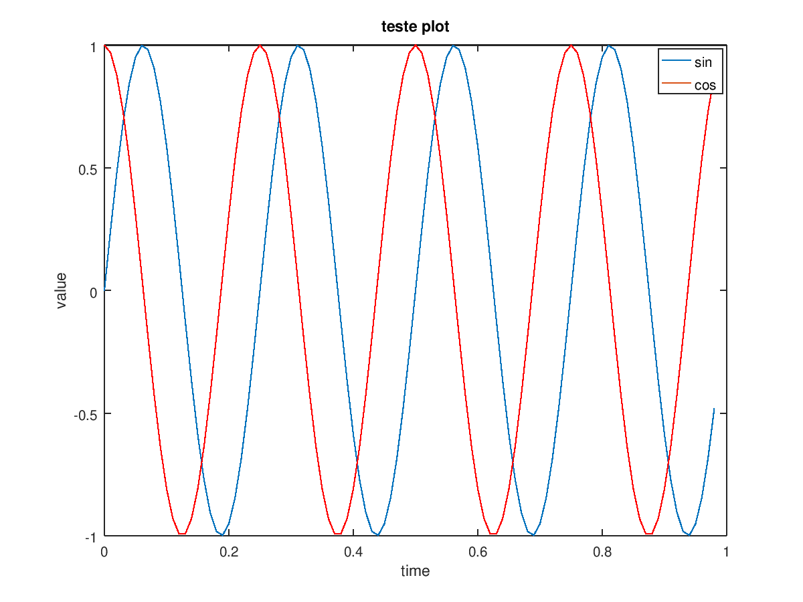
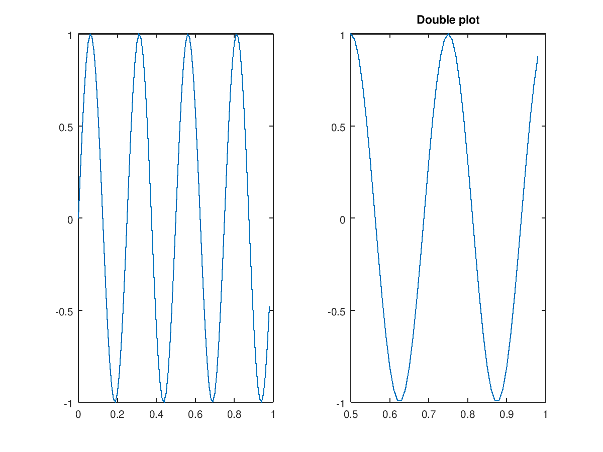
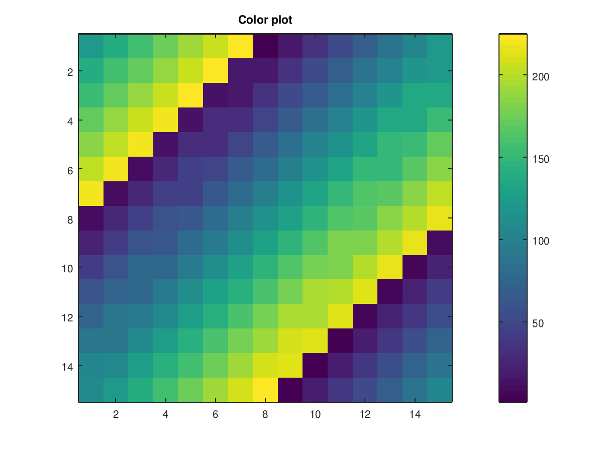
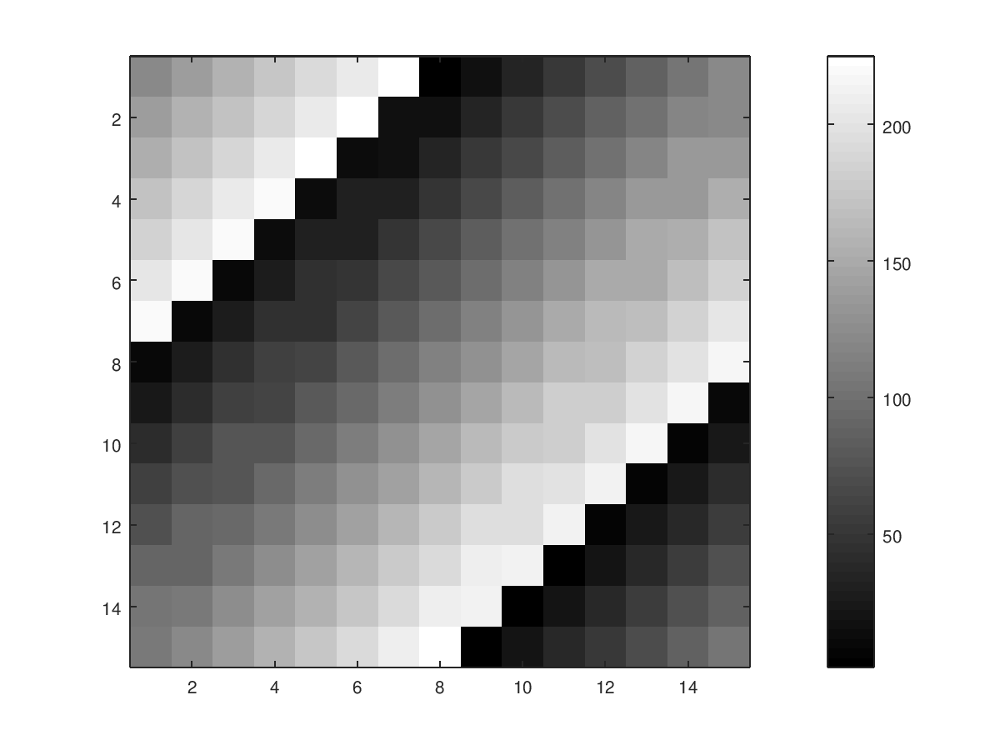

# Comandos de plotacao de dados
Segue comandos basicos do [Octave](http://www.gnu.org/software/octave) para geracao de graficos.
  * [Comando de geracao de grafico com plot](#comando-de-geracao-de-grafico-com-plot)
  * [Comando de geracao de grafico com imagesc](#comando-de-geracao-de-grafico-com-imagesc)
  * [Comando para salvar arquivo](#comando-para-salvar-arquivo)


## Comando de geracao de grafico com plot

Para gerar um grafico no [Octave](http://www.gnu.org/software/octave) usa-se o comando **plot()**. Para a exemplicacao foi criado 3 vetores de demonstracao seguindo o seguinte codigo:
```
t=[0:0.01:0.98]; // vetor com incrementacao de 0.01
y1 = sin(2*pi*4*t); // o seno dos valores de t
y2 = cos(2*pi*4*t); // o cosseno dos valores de t
```

Para gerar um grafico com uma ou varias linhas

```
plot(t,y1);           // Gera o grafico baseado em t e y1
hold on;              // Segura para que o proximo grafico seja gerado em conjunto
plot(t,y2,'r');       // Gera outro grafico na cor vermelha
xlabel('time');
ylabel('value');
legend('sin','cos');
title('teste plot');  
```

A seguir esta o grafico gerado pelo codigo acima:



Para gerar dois graficos na mesma imagem usa-se o **subplot()**. Para isso use duas figuras ou mais conforme a necessidade.
```
figure(1); plot(t, y1);
figure(2); plot(t, y2);
```
Para gerar um plot com o grafico 1 use o seguinte codigo:
```
subplot(1,2,1);
plot(t,y1);
```
O mesmo funciona para o proximo grafico.
```
subplot(1,2,2);
plot(t,y2);
```
Mas lembre que apos o subplot e o plot todas as configuracoes que tentar colocar sera passada para o grafico em questao, veja o exemplo abaixo e observe o segundo grafico da imagem abaixo.
```
axis([0.5 1 -1 1])
title('Double plot');
```



## Comando de geracao de grafico com imagesc

Considere a seguinte matriz
```
A = magic(15)
```

Para gerar um plot dos valores da matriz use o comando **imagesc()**.
```
imagesc(A), colorbar;
```



Para mudar a escala de cor use colormap.
```
imagesc(A), colorbar, colormap gray;
```


## Comando para salvar arquivo
Para salvar as imagens usa-se os seguintes comandos.
```
cd <caminho para salvar>;
print -dpng '<nome_da_imagem>.png'
```
